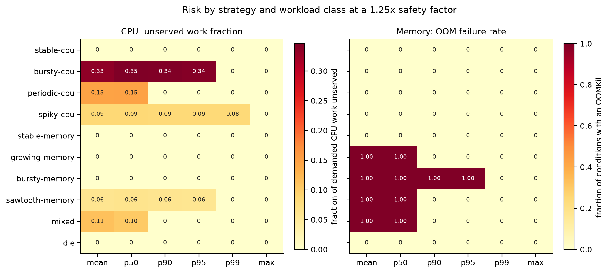

# Kubernetes Cost Optimization Engine

**A resource right-sizing system for Kubernetes, and a ground-truth study of
whether right-sizing recommendations can be trusted.**

The engine analyses historical CPU and memory usage, generates resource-specific
recommendations with explicit safety gates, estimates allocation-based
infrastructure waste, and exposes all of it over a REST API. Alongside it is a
reproducible experimental framework that evaluates right-sizing strategies
against *known ground truth* — which turns out to change the answers.

```
 ┌──────────────────────────────┐        ┌──────────────────────────────┐
 │      PRODUCTION SYSTEM       │        │     RESEARCH FRAMEWORK       │
 │                              │        │                              │
 │  Kubernetes ─► discovery     │        │  generative workloads        │
 │  Prometheus ─► usage history │        │  known demand, censored obs. │
 └──────────────┬───────────────┘        └──────────────┬───────────────┘
                │                                       │
                └───────────────┬───────────────────────┘
                                ▼
                    ┌───────────────────────┐
                    │  model.Series         │   one boundary, one engine
                    └───────────┬───────────┘
                                ▼
                    Recommendation engine
              strategies (pure) + safety gates
                                │
              ┌─────────────────┼─────────────────┐
              ▼                 ▼                 ▼
         cost model      risk classification   counterfactual replay
              │                 │                 │
              ▼                 ▼                 ▼
      REST API · CLI · Grafana        experiments · figures · report
```

Production mode and research mode run **the same recommendation engine**, through
the same entry point. Only the data source differs. That is what makes the
experimental findings statements about the deployed system rather than about a
research prototype.

---

## The problem this actually studies

Kubernetes reserves capacity by *declared request*, not by usage, so clusters
carry a lot of idle reserved capacity. Tools exist to fix that — the Vertical Pod
Autoscaler, Goldilocks, several commercial platforms — by recommending a high
percentile of historical usage.

This project started from a prior question:

> **How would you know whether a right-sizing recommendation was good?**

That turns out to be hard, because **the usage data available to evaluate a
recommendation is censored by the configuration being evaluated**. CPU that was
throttled was never recorded as used. A container killed at its memory limit never
recorded the working set it was reaching for. The measurement tops out at exactly
the value you need to estimate — and it does so hardest in the cases where the
configuration is wrong.

So the engine here is evaluated differently: synthetic workloads are generated
from known demand models, the engine sees only a *censored* observation of a
fitting window, and its recommendation is replayed against **uncensored demand
over a held-out period it never saw**.

---

## What the experiments found

49,800 scored conditions across ten workload classes, seven strategies, four
safety margins and four observation windows. [Full results](research/results.md).

| Finding | Evidence |
|---|---|
| **A reliability constraint reverses the strategy ranking** | mean and p50 lead on raw savings (69%) and deliver **zero** savings that survive the constraint; p99 delivers the most |
| **No percentile short of the maximum is universally safe** | p95 leaves **34%** of demanded CPU work unserved on bursty workloads; on spiky workloads **even p99 leaves 8.5%** |
| **The observed maximum is not an upper bound** | sizing memory to it with no margin survived only **47%** of conditions |
| **A safety margin cannot repair a statistic that excludes the event** | memory p95 plateaus at **90%** survival even at a **2.0×** margin; max reaches 100% at 1.2× |
| **CPU and memory fail on *different workloads*** | CPU fails on bursty/spiky; memory fails on bursty-memory, growing, sawtooth, mixed |
| **A short observation window is worse on every axis at once** | 1h vs 72h: more aggressive, 53% vs 67% feasible, and an order of magnitude more volatile |



*If one policy served both resources, these two panels would show the same
pattern. They do not — which is the evidence behind the engine's
resource-specific design.*

### The project's own default was refuted

It shipped with **CPU p95 × 1.15**, on the reasoning that CPU degradation is
recoverable and so tolerates a lower percentile. The reasoning is sound. Measured
against held-out demand, that default left **34% of demanded CPU work unserved**
on bursty workloads.

The replacement was derived from the same data — p99 × 1.25, plus an instability
gate that withholds CPU reductions above 20× burstiness — and confirmed in a
dedicated run: **100% feasibility across every class and seed at 33.7% median
savings.**

The cost is stated rather than hidden: p95 × 1.25 saves 58% at 80% feasibility.
An operator who knows their workloads are not spiky should prefer it. And the
burstiness threshold is the project's [most overfitted
parameter](research/threats_to_validity.md) — tuned on ten synthetic classes and
validated on the same ten.

---

## What it looks like

Real output, from a real cluster (kind + Prometheus + synthetic load generators):

```
$ koctl recommend --namespace demo

NAMESPACE  WORKLOAD        CONTAINER  CPU NOW  CPU REC  CPU   MEM NOW  MEM REC  MEM   RISK  $/MO SAVED
demo       idle            app        500m     40m      down  512Mi    95Mi     down  LOW   24.71
demo       bursty-cpu      app        1500m    640m     down  1Gi      409Mi    down  LOW   22.67
demo       stable-cpu      app        1        250m     down  1Gi      329Mi    down  LOW   20.18
demo       growing-memory  app        500m     140m     down  1Gi      735Mi    down  LOW    9.57

Allocation-based estimate over 4 workloads (policy c11c76cb86cf)
  current:     $108.62/month
  recommended: $31.49/month
  savings:     $77.13/month (71.0%)
  decisions:   8 decrease, 0 increase, 0 no change, 0 blocked, 0 insufficient data

This prices reserved capacity, not cloud invoices. A saving is realised only when
the freed capacity lets the cluster run fewer nodes. See docs/cost-model.md.
```

Every recommendation carries its evidence:

```json
{
  "decision": "BLOCKED",
  "risk": "HIGH",
  "current": "2Gi",
  "reason": "memory reduction withheld: 2 OOMKill(s) observed, so the working-set
             series is censored and understates true demand",
  "gates": ["oom-protection"],
  "observed": { "mean": "680.4Mi", "p95": "720.1Mi", "max": "780.0Mi", "burstiness": 1.15 },
  "strategy": "max", "safety_factor": 1.25, "samples": 10080
}
```

`BLOCKED` still reports the target the statistics produced, so the gate's effect is
measurable rather than invisible.

---

## Quick start

### Look at the research without installing anything

```bash
make experiments   # 49,800 conditions, ~2 minutes
make analysis      # every figure and table in the report
```

Everything in [research/results.md](research/results.md) regenerates from these
two commands. No figure or number in the report is transcribed by hand.

### Run it against a real cluster

```bash
make kind-e2e      # kind + Prometheus + demo workloads + optimizer + tests
```

Or against your own:

```bash
helm install cost-optimizer helm/k8s-cost-optimizer \
  --namespace cost-optimizer --create-namespace \
  --set prometheus.address=http://prometheus.monitoring.svc.cluster.local:9090

kubectl -n cost-optimizer port-forward svc/cost-optimizer-k8s-cost-optimizer 8080:8080
curl -s localhost:8080/api/v1/summary | jq
```

**This does not modify your cluster.** Mutation requires two independent settings
and is off by default — see [docs/security.md](docs/security.md).

---

## Safety model

The most realistic harm this tool can do is not a security breach. It is applying
a memory reduction to a production workload that then gets OOMKilled under load.
The controls are weighted accordingly:

- **Recommendation-only by default.** Mutation needs both `analysis.apply=true`
  *and* `rbac.allowApply=true`; setting one without the other fails at Helm render
  time, so a single typo cannot enable it.
- **Requests only, never limits.** A memory limit determines when the kernel kills
  the process; no usage series justifies changing that automatically.
- **`BLOCKED` and `INSUFFICIENT_DATA` are never applied** — those are exactly the
  cases where the engine declined to make a claim.
- **OOM history blocks memory reductions.** An OOMKilled container's series is
  censored and understates demand.
- **Missing evidence blocks memory reductions.** Absent evidence is not evidence of
  absence.
- **No `delete` verb, no secret access**, ever — enforced by chart tests.

Design principle throughout: **degrade to silence, never to a confident wrong
answer.**

---

## Repository map

| Path | Contents |
|---|---|
| [`research/`](research/) | The study: questions, methodology, results, threats to validity |
| [`docs/`](docs/) | Architecture, algorithm, cost model, security, failure modes, troubleshooting |
| [`internal/recommender/`](internal/recommender/) | Strategies, safety gates, the engine |
| [`internal/simulator/`](internal/simulator/) | Generative workloads, censoring, counterfactual replay |
| [`internal/experiment/`](internal/experiment/) | Matrix expansion, provenance, results — **no right-sizing logic** |
| [`experiments/configs/`](experiments/configs/) | Version-controlled experiment specifications |
| [`analysis/`](analysis/) | Python analysis; every figure and table |
| [`helm/`](helm/) | Chart with least-privilege RBAC and render-time guardrails |

Start with [`research/technical_report.md`](research/technical_report.md) for the
study, or [`docs/architecture.md`](docs/architecture.md) for the system.

---

## Documentation

**Research** — [Technical report](research/technical_report.md) ·
[Research questions](research/research_questions.md) ·
[Methodology](research/methodology.md) ·
[Experimental setup](research/experimental_setup.md) ·
[Results](research/results.md) ·
[Discussion](research/discussion.md) ·
[Limitations](research/limitations.md) ·
[Threats to validity](research/threats_to_validity.md) ·
[Related work](research/related_work.md)

**Engineering** — [Architecture](docs/architecture.md) ·
[Recommendation algorithm](docs/recommendation-algorithm.md) ·
[Cost model](docs/cost-model.md) ·
[Security](docs/security.md) ·
[Failure modes](docs/failure-modes.md) ·
[Troubleshooting](docs/troubleshooting.md)

---

## What this is not

Stated plainly, because a tool that overstates itself is worse than one that
reports a narrower but honest result:

- **Not a novel algorithm.** Every strategy evaluated is a standard statistic.
  Percentile-based right-sizing with asymmetric CPU/memory handling is the
  Vertical Pod Autoscaler's design.
- **Not better than Kubecost or OpenCost.** They solve cost *allocation* — given a
  real bill, who spent it — which is a harder problem requiring billing
  integration. A team wanting to know what their cluster costs should use those.
- **Not production-validated.** The findings come from synthetic workloads. The
  end-to-end test validates the collection path, not the findings.
- **Not a cloud bill.** Savings are allocation-based estimates and an **upper
  bound**: a reduction saves money only when freed capacity lets the cluster run
  fewer nodes.

The claim being made is about a **methodology and an empirical study** — a much
smaller claim than a novel algorithm, and the one the work supports.

---

## Status and license

Research prototype with a production-shaped implementation: tested at every level
(unit, property, fake-cluster, chart-render, end-to-end on kind), instrumented,
and deployable. Not validated in production.

Go 1.27 · Apache 2.0 · Contributions welcome — see
[CONTRIBUTING.md](CONTRIBUTING.md)
