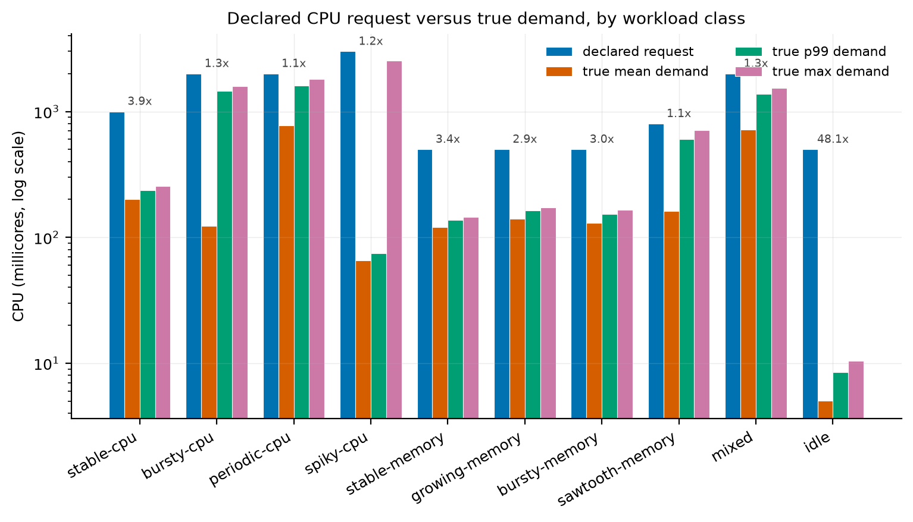
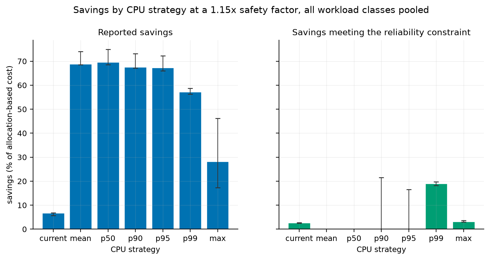
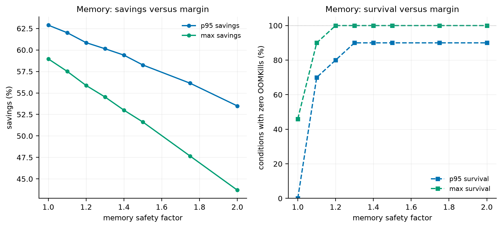
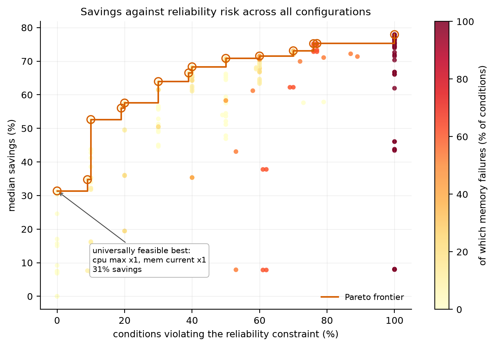
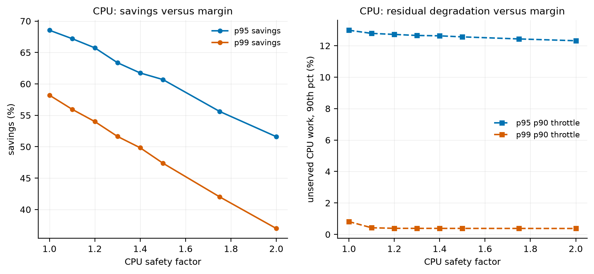
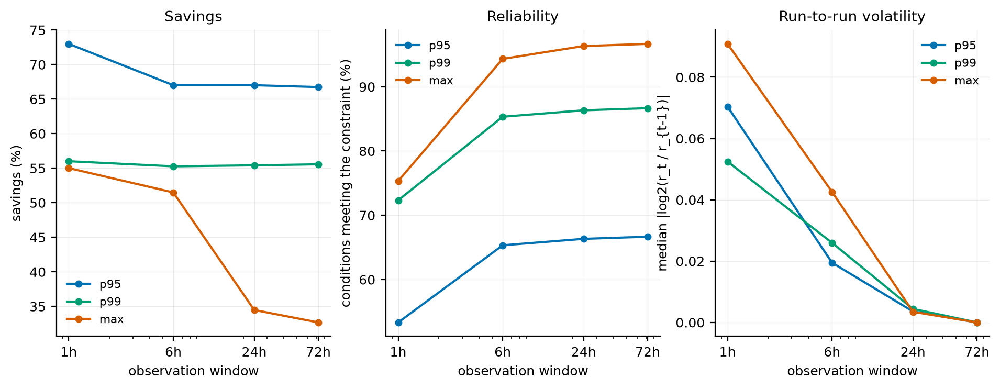
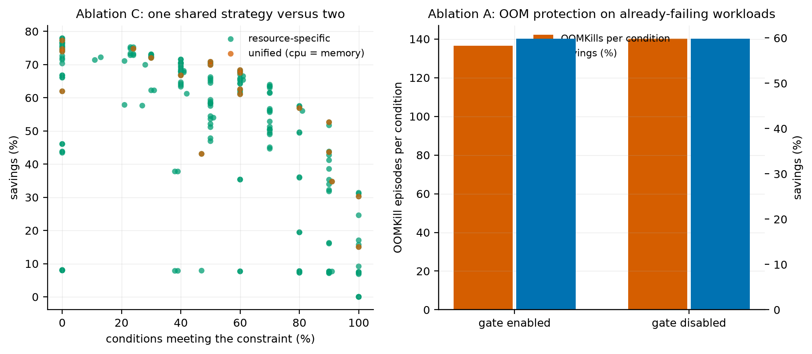

# Results

All figures and tables in this document are generated by
`analysis/scripts/figures.py` from the result files in `experiments/results/`.
Nothing here is transcribed by hand. To regenerate:

```bash
make experiments && make analysis
```

**Scope of the claims.** These results come from synthetic workloads with known
ground truth, not from production traces. They are statements about how these
right-sizing strategies behave on workloads with these structural properties. What
that does and does not license is set out in
[threats_to_validity.md](threats_to_validity.md), and the reader is asked to hold
that caveat over every number below.

**Experimental volume.** 48,248 conditions across nine configurations: 19,600 in
the main strategy comparison, 12,800 in the sensitivity analysis, 3,600 each for
observation windows and the OOM ablation, 3,200 for the no-gates ablation, 2,000
for the unified-strategy ablation, 1,600 each for the two OOM-recovery runs, 1,200
for the estimator comparison and 600 for the default validation. Each condition is
10 (or 5) independent trace realisations scored on a held-out horizon.

---

## RQ1 — Waste exists, but the figure depends entirely on the reference



Median over-provisioning of the declared request across the ten classes:

| Class | vs true p99 CPU | vs true max CPU | vs true max memory |
|---|---:|---:|---:|
| stable-cpu | 4.2x | 3.9x | 3.6x |
| bursty-cpu | 1.4x | 1.3x | 2.8x |
| periodic-cpu | 1.3x | 1.1x | 2.3x |
| spiky-cpu | **40.3x** | **1.2x** | 3.5x |
| stable-memory | 3.7x | 3.4x | 2.7x |
| growing-memory | 3.1x | 2.9x | 1.8x |
| bursty-memory | 3.3x | 3.0x | 2.0x |
| sawtooth-memory | 1.3x | 1.1x | 2.2x |
| mixed | 1.5x | 1.3x | 2.0x |
| idle | **58.8x** | **48.1x** | 10.9x |
| **pooled median** | — | **2.1x** | **2.5x** |

**Finding 1.1.** Over-provisioning ranges from 1.1x to 48x across classes. A
single headline waste figure describes the composition of a cluster more than it
describes any workload in it.

**Finding 1.2 (the more useful one).** The reference statistic changes the answer
by more than an order of magnitude for the same workload. The spiky class is 40x
its p99 demand and 1.2x its maximum. Both numbers are correct; they answer
different questions. A "40x over-provisioned" claim about that workload would be
true and would also justify a reduction that removes all headroom for its peak.

*Implication for reported savings generally:* any cost-optimisation figure that
does not state its reference statistic is not comparable with any other.

---

## RQ2 — The percentile ranking is not monotone, and it is not universal



Pooled across all classes at a 1.15x margin (medians, 95% bootstrap intervals):

| CPU strategy | savings | savings meeting the constraint | CPU utilisation | unserved work (p90) | feasible |
|---|---:|---:|---:|---:|---:|
| current | 6.7% [5.7, 6.8] | 2.6% | 22.1% | 0.0% | 74% |
| mean | 68.8% [68.6, 74.1] | **0.0%** | 77.4% | 19.9% | 34% |
| p50 | 69.6% [68.6, 75.0] | **0.0%** | 82.8% | 21.4% | 34% |
| p90 | 67.6% [67.2, 73.1] | 0.0% | 75.5% | 15.5% | 48% |
| p95 | 67.3% [65.9, 72.3] | 0.0% | 69.9% | 15.4% | 48% |
| p99 | 57.2% [56.3, 58.7] | **18.9%** | 58.6% | 0.3% | 65% |
| max | 28.1% [17.3, 46.2] | 3.1% | 38.8% | 0.0% | 74% |

**Finding 2.1 — the constraint reverses the ranking.** On reported savings, mean
and p50 lead. Under the reliability constraint their median feasible savings is
**zero**: essentially everything they saved was paid for with degradation. p99,
which looks mediocre on raw savings, is the only strategy with substantial
feasible savings. Reporting savings without a reliability constraint does not
merely overstate the benefit — it inverts the ordering.

**Finding 2.2 — the ranking is not monotone in the percentile.** p90 and p95 are
nearly indistinguishable from each other and from mean/p50 on savings (67–70%),
while differing by two orders of magnitude in median unserved work. The
interesting boundary is between p95 and p99, not spread evenly across the
percentile range.

### Per-class: where each strategy actually fails

Median fraction of demanded CPU work left unserved, 1.15x margin:

| Class | mean | p50 | p90 | p95 | p99 | max |
|---|---:|---:|---:|---:|---:|---:|
| stable-cpu | 0.001 | 0.000 | 0 | 0 | 0 | 0 |
| **bursty-cpu** | 0.337 | 0.349 | **0.346** | **0.344** | **0.000** | 0 |
| periodic-cpu | 0.184 | 0.190 | 0.001 | 0.000 | 0 | 0 |
| **spiky-cpu** | 0.086 | 0.088 | 0.086 | 0.085 | **0.085** | **0** |
| sawtooth-memory | 0.063 | 0.065 | 0.061 | 0.061 | 0.000 | 0 |
| mixed | 0.153 | 0.143 | 0.001 | 0.000 | 0 | 0 |
| *(stable-memory, growing-memory, bursty-memory, idle)* | ≈0 | ≈0 | 0 | 0 | 0 | 0 |

**Finding 2.3 — no percentile short of the maximum is universally safe.** On
bursty-cpu, p95 leaves 34% of demanded work unserved while p99 leaves none: the
bursts occupy 3.3% of the duty cycle, so p95 sits below them and p99 above. On
spiky-cpu, whose bursts occupy 0.2%, **even p99 fails** at 8.5% and only the
maximum succeeds.

This is the clearest result in the study. The safe percentile is not a property of
the strategy; it is determined by the workload's duty cycle, which the strategy
does not know.

---

## RQ3 — Memory ranks differently, and a safety margin cannot rescue a bad statistic



Percentage of conditions surviving the horizon with zero OOMKills:

| memory strategy | x1.00 | x1.15 | x1.25 | x1.50 |
|---|---:|---:|---:|---:|
| mean | 0% | 39% | 60% | 80% |
| p50 | 0% | 38% | 60% | 80% |
| p90 | 0% | 80% | 90% | 90% |
| p95 | 0% | 80% | 90% | 90% |
| p99 | 0% | 90% | **100%** | **100%** |
| max | 47% | 91% | **100%** | **100%** |

**Finding 3.1 — the observed maximum is not an upper bound on the next period.**
Sizing memory to the maximum seen in the fitting window, with no margin, survived
only **47%** of conditions. This is the most counter-intuitive result here: "just
use the maximum" is a common intuition and it fails more than half the time,
because the maximum of a finite sample is an estimate of the distribution's upper
tail, not a bound on it. Full survival required a margin of at least 1.2x.

**Finding 3.2 — a margin cannot repair a statistic that excludes the event.**
Extending the sensitivity sweep to a 2.0x margin:

| memory strategy | x1.0 | x1.1 | x1.2 | x1.3 | x1.5 | x1.75 | x2.0 |
|---|---:|---:|---:|---:|---:|---:|---:|
| p95 | 0% | 70% | 80% | 90% | 90% | 90% | **90%** |
| max | 46% | 90% | **100%** | 100% | 100% | 100% | 100% |

p95 plateaus at 90% and stays there even at a 2.0x margin, while max reaches 100%
at 1.2x. The cause is structural rather than statistical: on the bursty-memory
class, p95 of the working set is roughly 27% of its peak, so no multiplier applied
to p95 reaches the peak. **A safety factor is not a substitute for a statistic
that covers the event you need to survive.**

Per class at a 1.25x margin, the failures are entirely concentrated:

| Class | mean | p50 | p90 | p95 | p99 | max |
|---|---:|---:|---:|---:|---:|---:|
| growing-memory | 0% | 0% | 100% | 100% | 100% | 100% |
| **bursty-memory** | 0% | 0% | **0%** | **0%** | 100% | 100% |
| sawtooth-memory | 0% | 0% | 100% | 100% | 100% | 100% |
| mixed | 0% | 0% | 100% | 100% | 100% | 100% |
| *(all other classes)* | 100% | 100% | 100% | 100% | 100% | 100% |

---

## RQ4 — Workload class determines the answer, and the two resources disagree


This figure carries the project's central claim. If one policy served both
resources, the two panels would show the same pattern. They do not:

- **On CPU**, p90 and p95 are safe on most classes and fail on bursty-cpu and
  spiky-cpu — the classes with short, rare peaks.
- **On memory**, the same percentiles fail completely on bursty-memory, a class
  where CPU is entirely unproblematic, and succeed on bursty-cpu, where CPU fails.

The failures are not merely different in magnitude; they occur on **different
workloads**. A single shared policy would either accept memory kills to capture CPU
savings, or forgo CPU savings to stay safe on memory.

**Finding 4.1.** The number of configurations (out of 196) that were feasible on
every seed varies from **40** (spiky-cpu) to **152** (stable-cpu). The size of the
safe configuration space is itself a property of the workload.

---

## RQ5 — The trade-off, and what universal safety costs



**Finding 5.1.** Of 196 configurations, **16 were feasible on every workload class
and every seed**. The best of them:

| CPU | memory | margin | savings | feasible |
|---|---|---:|---:|---:|
| max | current *(no memory change)* | 1.00 | **31.4%** | 100% |
| max | p99 | 1.25 | 31.1% | 100% |
| max | max | 1.25 | 30.2% | 100% |

The most aggressive configuration overall reaches 77.9% savings. **The price of
universal safety across this workload population is roughly 46 percentage
points** — and, strikingly, every universally-safe configuration uses `max` for
CPU.

**Finding 5.2 — the best policy per class differs sharply.**

| Class | best feasible CPU | best feasible memory | savings |
|---|---|---|---:|
| stable-cpu | mean x1.15 | mean x1.15 | 76.4% |
| bursty-cpu | p99 x1.0 | *no change* | 26.1% |
| periodic-cpu | p95 x1.0 | *no change* | 25.4% |
| spiky-cpu | max x1.0 | *no change* | 15.0% |
| stable-memory | mean x1.15 | mean x1.15 | 68.6% |
| growing-memory | mean x1.25 | p90 x1.25 | 57.6% |
| bursty-memory | mean x1.15 | p99 x1.15 | 59.9% |
| sawtooth-memory | p99 x1.15 | p90 x1.15 | 23.9% |
| mixed | p95 x1.0 | *no change* | 33.0% |
| idle | mean x1.15 | p90 x1.15 | **97.3%** |

Two observations. First, the achievable saving ranges from 15% to 97% depending
only on workload shape. Second, on four of ten classes the safest profitable
configuration involves **no memory reduction at all** — the memory saving was not
worth its risk, and the CPU saving carried the result.

**Finding 5.3 — diminishing returns in the margin.**



Beyond roughly 1.2x, residual CPU degradation is almost flat while savings
continue to fall linearly. The flat portion is not noise: it is demand sitting
structurally above the percentile, which no multiplier applied to that percentile
can reach. Increasing the margin past that point buys nothing and costs
proportionally.

---

## RQ6 — A short window is worse on every axis at once



Every window is scored on the same held-out 24-hour horizon.

| window | strategy | savings | feasible | volatility | worst swing | spread |
|---|---|---:|---:|---:|---:|---:|
| 1h | p95 | 73.0% | 53% | 0.070 | 0.093 | 1.07x |
| 1h | p99 | 56.0% | 72% | 0.053 | 0.127 | 1.23x |
| 1h | max | 55.0% | 75% | 0.091 | 0.139 | 1.20x |
| 6h | max | 51.5% | 94% | 0.043 | 0.089 | 1.07x |
| 24h | max | 34.5% | 96% | 0.004 | 0.013 | 1.01x |
| 72h | max | **32.7%** | **97%** | **0.000** | 0.000 | 1.00x |

**Finding 6.1 — window length and strategy interact, and not in the obvious
direction.** Savings under the max policy *fall* from 55% to 33% as the window
grows, because a longer history contains rarer and taller peaks, so a
maximum-based target grows with the window. Under p95 savings are essentially flat
(73% → 67%). Window length is not a neutral parameter applied to a fixed strategy;
it changes what the strategy means.

**Finding 6.2 — a short window is not a savings/freshness trade.** At one hour the
p95 policy is simultaneously *more aggressive* (73% savings), *less reliable* (53%
feasible against 67% at 72h), and *an order of magnitude more volatile* (0.070
against 0.000). It is worse on every axis. The apparent extra saving is an
artefact of not having observed the peaks yet.

**Finding 6.3 — volatility is real but below the action threshold.** Run-to-run
churn was **0.0%** at every window: no recomputation moved a recommendation by
more than the 10% minimum-change threshold. The volatility is genuine but the
minimum-change gate absorbs it entirely. This is a negative result for the concern
that motivated RQ7 — under these conditions, recommendation instability was not an
operational problem — and it is the gate, not the underlying stability of the
statistic, that makes it so.

---

## Ablation studies



### Ablation C — one shared strategy versus two

|  | universally feasible configs | best universally-feasible savings | best savings at any risk |
|---|---:|---:|---:|
| unified (CPU = memory) | 2 of 20 | 30.2% | 77.3% |
| resource-specific | 16 of 196 | **31.4%** | 77.9% |

**Finding A.1 — the effect is real but smaller than the design rhetoric implies.**
Separating the policies raises the best universally-safe saving from 30.2% to
31.4%: 1.2 percentage points. The larger difference is in the *shape* of the
space — 10% of resource-specific configurations are universally feasible against
8% for unified, and the per-class table in RQ5 shows the separation matters much
more for individual workloads than in aggregate.

Stated plainly: **the resource-specific design is supported, but as a modest
aggregate improvement plus a substantial per-workload one, not as the dramatic win
the design argument might suggest.** Reporting it otherwise would overstate the
evidence.

### Ablation A — OOM protection, and an experiment that first measured nothing

The first version of this ablation returned **bit-identical results** with the OOM
gate enabled and disabled.

The cause was a flaw in the experiment, not in the gate. Every catalog workload is
deliberately over-provisioned, so at its declared configuration it never OOMs; the
synthesised reliability evidence therefore always showed zero OOMKills and the gate
had nothing to act on. **An ablation that cannot observe the component it ablates
measures nothing**, and reporting "the gate has no effect" from it would have been
a false negative produced by the design.

The corrected experiment (`experiments/configs/oom_recovery.yaml`) deploys each
workload at 35% of its catalog memory request, creating the population the gate
exists to protect: workloads already being killed, whose observed working-set
series is censored at the limit and therefore understates what they need.

On that population:

|  | savings | survival | OOMKills/condition | memory reductions blocked |
|---|---:|---:|---:|---:|
| gate enabled | 59.8% | 44.8% | **136.6** | 10.6% |
| gate disabled | 59.8% | 44.8% | **140.1** | — |

In the worst cell (mean x1.0) the gate cuts kill episodes from 451 to 395 per
condition, a 12% reduction, **at no cost in savings**.

**Finding A.2 — the gate is narrow, free, and does not rescue anything.** It
prevents one specific pathological action — reducing memory on a workload already
being killed — which arises in 10.6% of conditions in this population. It does not
improve survival, because an under-provisioned workload needs an *increase*, which
the engine correctly recommends in 69% of these cases. The gate's value is in
avoiding harm, not in producing benefit, and it should be described that way.

**Finding A.3 — censoring reproduces the failure.** On this censored population,
`max` at a 1.0x margin survived only **16%** of conditions, against 47% on the
healthy population. The reason is direct: when the series is censored at the
limit, the maximum observed *is* the limit that is killing the workload, so a
max-based policy recommends exactly the failing configuration. This is the
censoring problem of [methodology.md](methodology.md) appearing as a measurable
effect rather than an argument.

### Ablations B, D, E — all gates and post-processing removed

|  | savings | feasible | OOMKills/condition | unserved CPU work |
|---|---:|---:|---:|---:|
| gates enabled | 64.2% | **37.4%** | 108.0 | 0.003% |
| gates disabled | 64.8% | 35.6% | 111.5 | 0.019% |

**Finding A.4 — in aggregate the gates barely matter; per class they matter a
lot.** Removing every gate changes pooled savings by 0.6 points and feasibility by
1.8 points. But on the idle class the floor gate is the difference between a
recommendation of 10–20m and one of 4.9–13.9m, the latter being below the
granularity at which CFS enforces quota and leaving no headroom for process
startup. Aggregate ablation metrics hide effects that are concentrated in a
minority of workloads — which is an argument about how ablations should be read,
not only about these gates.

### Estimator comparison — linear interpolation versus nearest rank

| window | strategy | linear savings | nearest-rank savings | linear feasible | nearest feasible |
|---|---|---:|---:|---:|---:|
| 1h | p99 | 60.0% | **56.0%** | 71.5% | **72.5%** |
| 6h | p99 | 55.6% | 55.6% | 83.0% | 84.5% |
| 24h | p99 | 55.7% | 55.7% | 84.5% | 84.5% |

**Finding A.5.** The estimators diverge only on the one-hour window, where a p99
over few samples interpolates between the two largest observations. Nearest rank
is 4 points more conservative there and 1 point more feasible. Beyond six hours
the choice is immaterial. The effect is small, but it is a genuine confound for
short-window results that most cost tooling does not state.

---

## The shipped default was refuted, and replaced from the data

This project began with a default of **CPU p95 x1.15, memory max x1.25**, on the
reasoning that CPU degradation is recoverable and therefore tolerates a lower
percentile. The reasoning is sound. The default was wrong:

| Class | p95 x1.15 unserved CPU work | feasible |
|---|---:|---:|
| bursty-cpu | **34.3%** | **0%** |
| sawtooth-memory | 6.1% | 0% |
| growing-memory | 0.0% | 10% |

The revision was derived from the same data rather than guessed:

1. At a 1.25x margin, p99 is safe on every class **except spiky-cpu**.
2. Observed burstiness (max/mean, already computed by the engine) separates that
   class cleanly: spiky-cpu measures 38–43, while every other class — bursty-cpu
   included, at 13.0 — measures below 14.
3. The instability gate at a threshold of 20 should therefore withhold the
   reduction on exactly the class where p99 fails.

That prediction was tested in a confirmatory run
(`experiments/configs/validate_default.yaml`):

| CPU policy | margin | savings | feasible | unserved work (p90) |
|---|---:|---:|---:|---:|
| p95 + gate | 1.25 | 58.2% | 80% | 8.7% |
| **p99 + gate** | **1.25** | **33.7%** | **100%** | **0.0%** |
| max + gate | 1.25 | 30.3% | 100% | 0.0% |

Per class under the revised default, every class is feasible on every seed:

| Class | decision | savings |
|---|---|---:|
| stable-cpu | DECREASE | 69.6% |
| bursty-cpu | NO_CHANGE | 2.8% |
| periodic-cpu | NO_CHANGE | 2.3% |
| spiky-cpu | **BLOCKED** *(instability gate)* | 2.2% |
| stable-memory | DECREASE | 61.1% |
| growing-memory | DECREASE | 52.3% |
| bursty-memory | DECREASE | 50.8% |
| sawtooth-memory | NO_CHANGE | 11.8% |
| mixed | DECREASE | 15.4% |
| idle | DECREASE | 95.3% |

**Finding D.1.** The revised default is the only evaluated configuration that was
feasible on every class and every seed while producing substantial savings (median
33.7%). It achieves that partly by *declining to act*: it recommends no change on
three classes and explicitly blocks one.

**The cost is stated rather than hidden.** p95 x1.25 saves 58.2% against this
configuration's 33.7%, and is feasible on 80% of conditions rather than 100%. An
operator who knows their workloads are not spiky can reasonably choose the cheaper
policy. The default is conservative because the engine cannot know that on their
behalf.

**The threshold was tuned on these ten synthetic classes.** It has not been
validated against production traces, and
[threats_to_validity.md](threats_to_validity.md) treats that as the most likely
place this configuration fails to generalise. The value 20 should be read as "a
threshold derived from this population by a stated procedure", not as a constant
of nature.

---

## Summary of findings

| # | Finding |
|---|---|
| 1.2 | The over-provisioning figure changes by more than 30x with the reference statistic for the same workload; a waste claim without its reference is not comparable. |
| 2.1 | The reliability constraint **reverses** the strategy ranking: mean and p50 lead on raw savings and deliver zero feasible savings. |
| 2.3 | No percentile short of the maximum is universally safe; the safe percentile is set by the workload's duty cycle, which the strategy cannot see. |
| 3.1 | The observed maximum is **not** an upper bound out of sample: max x1.0 survived only 47% of conditions. |
| 3.2 | A safety margin cannot rescue a statistic that excludes the event — p95 memory plateaus at 90% survival even at a 2.0x margin. |
| 4.1 | CPU and memory fail on **different workloads**, not merely to different degrees. |
| 5.1 | Universal safety across this population costs ~46 percentage points of savings, and every universally-safe configuration uses max for CPU. |
| 6.2 | A one-hour window is worse on every axis at once — more aggressive, less reliable, and more volatile. |
| A.1 | Resource-specific policies help, but by 1.2 points in aggregate: real, and smaller than the design argument implies. |
| A.2 | OOM protection is narrow and free: it avoids one harmful action in 10.6% of at-risk conditions and rescues nothing. |
| A.3 | On a censored series, a max-based policy recommends the very limit that is killing the workload (16% survival). |
| A.4 | Aggregate ablation metrics hide effects concentrated in a minority of workloads. |
| D.1 | The project's own initial default was refuted by its own experiments and replaced with an evidence-derived one. |
